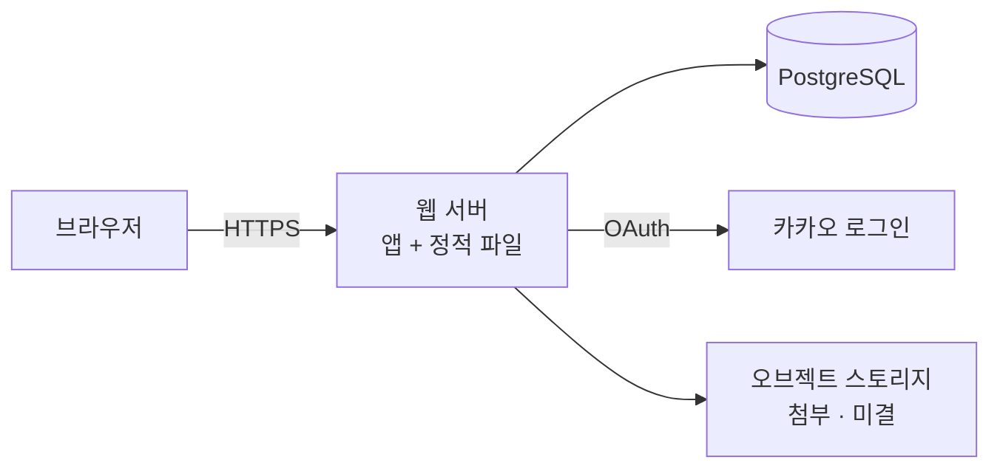

# INFRA: 동아리 게시판 인프라와 제약

## 1. 제약

#### C1 서버는 한 대다

회원 40명, 글 5000건. 이중화·오토스케일을 하지 않는다. 근거: [[BBS-PRD-001#N1]]

#### C2 운영자가 서버 관리자가 아니다

박태현은 총무지 개발자가 아니다. **터미널을 열게 하지 않는다** — 배포는 자동, 백업도 자동이어야 한다. 근거: [[BBS-SCN-001#P2]]

#### C3 로그인은 직접 만들지 않는다

비밀번호를 우리가 보관하면 그 순간 보안 책임이 생긴다. 외부 제공자에게 맡긴다. 근거: [[BBS-PRD-001#R2]]

#### C4 읽기는 인증 없이 열린다

목록·본문·댓글은 로그인 없이 보인다. 쓰기만 막는다. 근거: [[BBS-PRD-001#N2]]

## 2. 구성도

## 3. 기술 스택

| 층 | 고른 것 | 이유 |
|---|---|---|
| 웹 | 서버 렌더링 + 약간의 JS | 오십 대 회원의 구형 브라우저에서 흰 화면이 안 뜬다. 근거: [[BBS-SCN-001#P1]] |
| DB | PostgreSQL | 전문 검색과 인덱스가 있고 운영 사례가 많다 |
| 로그인 | 카카오 OAuth | 회원 전원이 이미 쓴다. 근거: [[#C3]] |
| 배포 | 컨테이너 + 관리형 호스팅 | 근거: [[#C2]] |

## 4. 데이터가 사는 곳

| 데이터 | 어디 | 잃으면 |
|---|---|---|
| 글·댓글·신고 | PostgreSQL | **복구 불가** — 매일 자동 덤프 |
| 회원 | PostgreSQL (카카오 id만) | 다시 로그인하면 복구 |
| 세션 | 서명 쿠키 | 전원 재로그인 |
| 첨부 사진 | 미정 | 미결사항 참조 |

## 5. 인증과 접근

- 세션은 서명 쿠키 하나. 세션 테이블을 두지 않는다
- 운영자 여부는 회원 행의 플래그. 운영자는 2명뿐이라 권한 체계를 만들지 않는다
- 숨긴 글은 지우지 않는다. 근거: [[BBS-UC-001#UC-S2]]

## 6. 미결사항

- [ ] 첨부 사진 보관 — 오브젝트 스토리지인지 DB인지. 비용과 용량 상한을 정해야 한다
- [ ] 백업 보관 기간 — 매일 덤프를 며칠 들고 있을지
