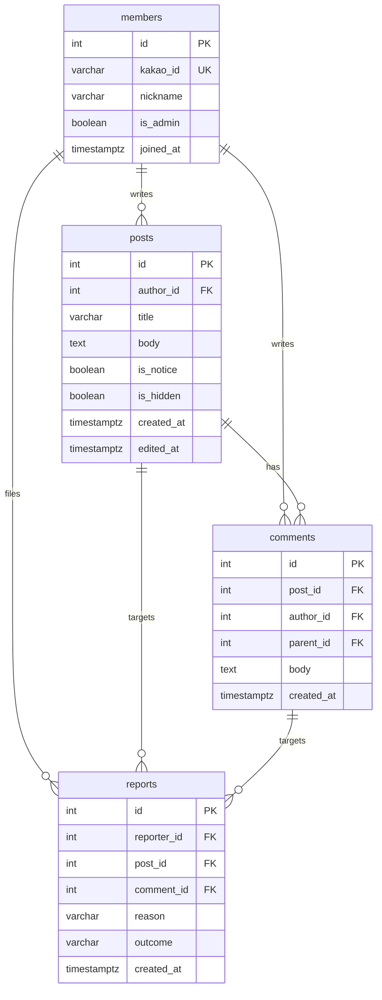

# DOM: 동아리 게시판 ERD와 DD

## 1. ERD

## 2. DD

#### members 회원 표

| 컬럼 | 타입 | 제약 | 뜻 |
|---|---|---|---|
| id | int | PK | |
| kakao_id | varchar(40) | NOT NULL UNIQUE | 카카오가 주는 식별자. 근거: [[BBS-INFRA-001#C3]] |
| nickname | varchar(20) | NOT NULL | 화면에 보이는 이름 |
| is_admin | boolean | NOT NULL default false | 운영자 2명뿐이라 플래그 하나 |
| joined_at | timestamptz | NOT NULL | |

#### posts 글 표

| 컬럼 | 타입 | 제약 | 뜻 |
|---|---|---|---|
| id | int | PK | |
| author_id | int | FK members NOT NULL | 탈퇴해도 행은 남는다 |
| title | varchar(100) | NOT NULL | 근거: [[BBS-PRD-001#R2]] |
| body | text | NOT NULL | 10000자 상한은 앱이 본다 |
| is_notice | boolean | NOT NULL default false | 공지 고정. 근거: [[BBS-PRD-001#R1]] |
| is_hidden | boolean | NOT NULL default false | **지우지 않고 숨긴다.** 근거: [[BBS-UC-001#UC-S2]] |
| created_at | timestamptz | NOT NULL | |
| edited_at | timestamptz | NOT NULL | 생성 시엔 created_at과 같다 |

#### comments 댓글 표

| 컬럼 | 타입 | 제약 | 뜻 |
|---|---|---|---|
| id | int | PK | |
| post_id | int | FK posts NOT NULL ON DELETE CASCADE | 글과 한 묶음. 근거: [[BBS-DOM-002#Comment]] |
| author_id | int | FK members NOT NULL | |
| parent_id | int | FK comments null 허용 | null이면 원댓글 |
| body | text | NOT NULL | |
| created_at | timestamptz | NOT NULL | |

#### reports 신고 표

| 컬럼 | 타입 | 제약 | 뜻 |
|---|---|---|---|
| id | int | PK | |
| reporter_id | int | FK members NOT NULL | |
| post_id | int | FK posts null 허용 | 글 신고면 채운다 |
| comment_id | int | FK comments null 허용 | 댓글 신고면 채운다 |
| reason | varchar(20) | NOT NULL | 광고 · 욕설 · 기타 |
| outcome | varchar(10) | null 허용 | null이면 미처리. hidden · ignored |
| created_at | timestamptz | NOT NULL | |

**`post_id`와 `comment_id` 중 정확히 하나만 채운다** — CHECK 제약으로 막는다.

## 3. 인덱스

| 표 | 인덱스 | 이유 |
|---|---|---|
| posts | `(is_hidden, is_notice desc, created_at desc)` | 목록 한 번에. 근거: [[BBS-PRD-001#N1]] |
| posts | `(title) gin trgm` | 제목 검색. 근거: [[BBS-PRD-001#R5]] |
| comments | `(post_id, created_at)` | 글 하나의 댓글 |
| reports | `(outcome) where outcome is null` 부분 | 운영자의 미처리 목록 |
| reports | `(reporter_id, post_id, comment_id)` unique | 중복 신고 금지. 근거: [[BBS-UC-001#UC-H6]] |

## 4. 미결사항

- [ ] 조회수를 posts에 둘지 별도 표로 뺄지 — 매 조회마다 UPDATE가 부담이다
