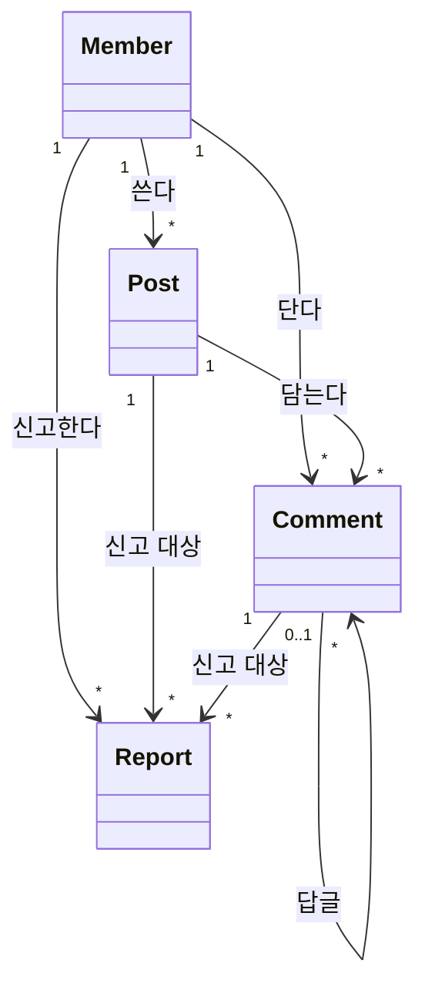

# 도메인 모델: 동아리 게시판

## 1. 개념 식별

유스케이스 본문에서 명사를 뽑아 남긴 것이 아래 여섯이다. "목록"·"페이지"는 화면이지 개념이 아니라 뺐다.

#### Member 회원

로그인한 사람. 카카오 id로 식별한다. 운영자 여부를 함께 가진다. 근거: [[BBS-UC-001#UC-S1]]

#### Post 글

제목과 본문. 공지 여부와 숨김 여부를 가진다. 근거: [[BBS-UC-001#UC-H2]]

#### Comment 댓글

글에 달린다. 부모 댓글을 하나까지 가진다. 근거: [[BBS-UC-001#UC-H4]]

#### Report 신고

누가 어떤 글·댓글을 왜 신고했는지. 처리 결과를 가진다. 근거: [[BBS-UC-001#UC-H6]]

#### Board 게시판

지금은 하나뿐이라 **개념으로만 두고 테이블을 만들지 않는다.** 나중에 카테고리가 생기면 여기서 자란다.

#### Session 세션

쿠키에 사는 값. DB에 없다. 근거: [[BBS-INFRA-001#C3]]

## 2. 개념 모델

## 3. 개념별 정리

| 개념 | 생기는 때 | 사라지는 때 | 불변 규칙 |
|---|---|---|---|
| Member | 첫 카카오 로그인 | 탈퇴 (글은 남고 이름만 `(탈퇴한 회원)`) | 카카오 id는 유일 |
| Post | 회원이 저장 | 글쓴이·운영자가 지울 때. **숨김은 삭제가 아니다** | 공지는 운영자만 |
| Comment | 회원이 저장 | 글이 지워지면 함께 | 답글의 답글 없음 |
| Report | 회원이 신고 | 지워지지 않는다 | (신고자, 대상) 한 쌍은 한 번 |

## 4. 경계

- **글과 댓글은 한 묶음이다.** 글을 지우면 댓글이 함께 간다. 따로 살 수 없다
- **신고는 다른 묶음이다.** 신고는 글을 가리키지만 글의 일부가 아니다 — 글이 숨겨져도 신고 이력은 남는다
- **회원은 또 다른 묶음이다.** 글·댓글은 회원을 id로만 가리킨다. 탈퇴해도 글이 깨지지 않아야 한다

## 5. 미결사항

- [ ] 탈퇴한 회원의 글을 지울지 남길지 — 지금은 남기는 쪽으로 적었다
