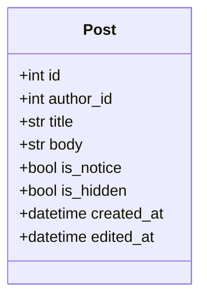
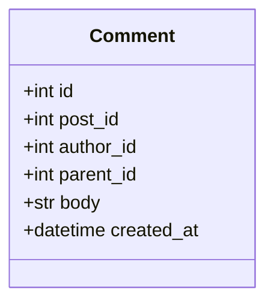
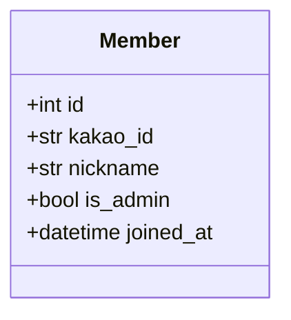
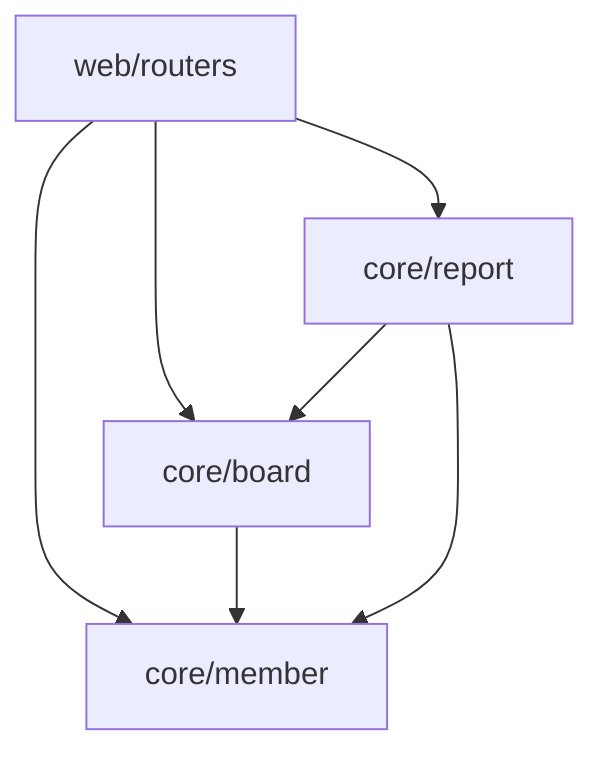

# 클래스 명세: 동아리 게시판

## 1. 폴더 구조

```
app/
├── web/          라우터 · 템플릿 · 정적 파일
├── core/
│   ├── member/   Member 묶음
│   ├── board/    Post · Comment 묶음
│   └── report/   Report 묶음
└── db.py         엔진 · 세션
```

**묶음 하나 = 폴더 하나.** [[BBS-DOM-002]] 4장의 경계를 폴더로 옮긴 것이다.

## 2. 엔티티

#### Post 글 엔티티



`edited_at`이 `created_at`과 다르면 화면에 `(수정됨)`을 붙인다. 근거: [[BBS-PRD-001#R3]]

#### Comment 댓글 엔티티



`parent_id`가 있으면 답글이다. **답글의 `parent_id`는 반드시 null인 댓글을 가리킨다** — 한 단계 제한. 근거: [[BBS-UC-001#UC-H4]]

#### Member 회원 엔티티



## 3. 의존 관계



**`core/member`는 아무도 안 부른다.** 가장 아래다. `core/board`가 `core/report`를 부르지 않는 것이 중요하다 — 글은 신고를 몰라도 된다.

## 4. 설계 클래스

#### PostService 글 서비스

목록·읽기·쓰기·고치기·지우기. 공지 고정 정렬이 여기 있다. 근거: [[BBS-UC-001#UC-H2]] · [[BBS-UC-001#UC-H3]]

#### CommentService 댓글 서비스

달기·지우기. 답글 한 단계 규칙을 여기서 막는다. 근거: [[BBS-UC-001#UC-H4]]

#### ReportService 신고 서비스

신고 접수·중복 거부·처리. 근거: [[BBS-UC-001#UC-H6]] · [[BBS-UC-001#UC-A7]]

#### MemberService 회원 서비스

카카오 id로 찾거나 만든다. 운영자 판정. 근거: [[BBS-UC-001#UC-S1]]

## 5. 미결사항

- [ ] 검색을 `PostService`에 둘지 따로 뺄지 — 전문 검색으로 가면 분리해야 한다
