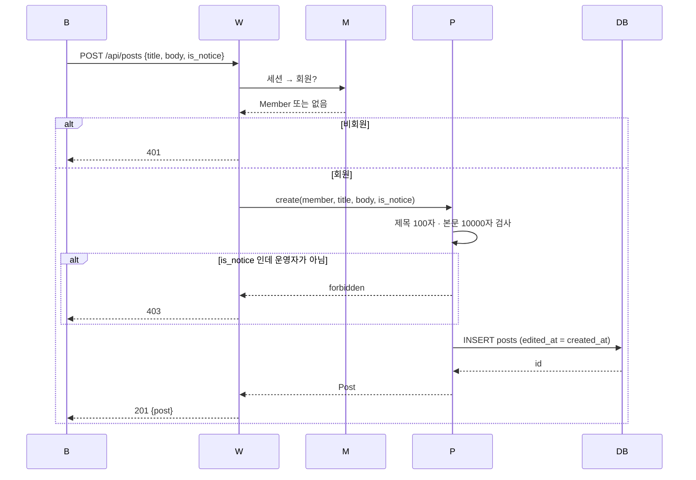
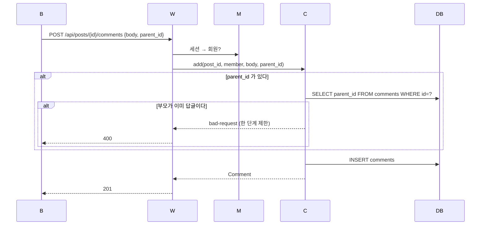
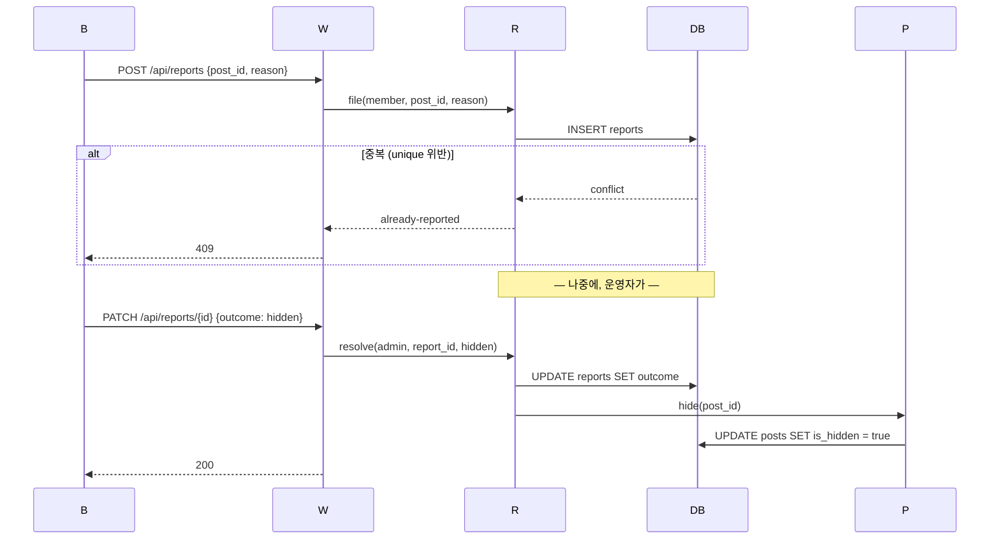

# 시퀀스: 동아리 게시판

## 1. 생명선

| 약칭 | 무엇 |
|---|---|
| B | 브라우저 |
| W | 웹 라우터 |
| P | PostService |
| C | CommentService |
| R | ReportService |
| M | MemberService |
| DB | PostgreSQL |

## 2. 시퀀스

#### SEQ-1 글을 쓴다

근거: [[BBS-UC-001#UC-H2]] · [[BBS-API-001#POST/api/posts]]

**읽을 때 볼 것**: 길이 검사가 서비스 안이다. 라우터는 형식만 본다.

#### SEQ-2 댓글을 단다

근거: [[BBS-UC-001#UC-H4]] · [[BBS-API-001#POST/api/posts/{postId}/comments]]

#### SEQ-3 신고하고 숨긴다

근거: [[BBS-UC-001#UC-H6]] · [[BBS-UC-001#UC-A7]] · [[BBS-UC-001#UC-S2]]

**지우지 않는다.** 숨김은 플래그다. 근거: [[BBS-DOM-001#posts]]

## 3. 대응표

| 시퀀스 | 유스케이스 | 엔드포인트 |
|---|---|---|
| [[#SEQ-1]] | [[BBS-UC-001#UC-H2]] | [[BBS-API-001#POST/api/posts]] |
| [[#SEQ-2]] | [[BBS-UC-001#UC-H4]] | [[BBS-API-001#POST/api/posts/{postId}/comments]] |
| [[#SEQ-3]] | [[BBS-UC-001#UC-H6]] · [[BBS-UC-001#UC-A7]] | [[BBS-API-001#POST/api/reports]] |

## 4. 되먹일 것

- [[BBS-API-001]]의 `POST/api/posts`는 403 조건을 "운영자가 아닌데 is_notice"로만 적었는데, 시퀀스를 그려 보니 **비회원은 401**이 먼저다. API 쪽에 401을 명시해야 한다
